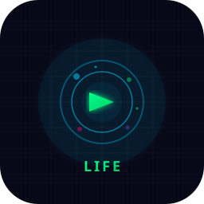

<div align="center">
  
  <br><br>
  <p>
    
    
    
    
  </p>
  <br>
  <p><strong>A flagship life-sandbox simulation for RQBBOX OS — live your neon life in the sprawling world of RQBBOX City.</strong></p>
  <br>
  
  <br>
</div>

---

## Overview

**RQBBOX LIFE** is an open-ended life simulation game where every player writes their own story. Start with nothing in a studio apartment and build your legacy: career, home, relationships, wealth, and more. Set in the neon-drenched **RQBBOX City**, the game blends deep simulation systems, real-time day/night phases, procedural NPC relationships, and quick-session gameplay.

Originally built for **RQBBOX MODE** and **RQBBOX OS**, RQBBOX LIFE runs as a standalone HTML5 game — no installs, no dependencies, just open and play.

---

## Features

<table>
  <tr>
    <td width="33%" align="center"><b>🧬 Character Creator</b><br><sub>Choose your name and lifestyle archetype</sub></td>
    <td width="33%" align="center"><b>💼 Career System</b><br><sub>10 jobs from Cashier to CEO</sub></td>
    <td width="33%" align="center"><b>🏠 Housing Tiers</b><br><sub>6 residences from Studio to Cyber Estate</sub></td>
  </tr>
  <tr>
    <td width="33%" align="center"><b>🚗 Vehicle Upgrades</b><br><sub>7 vehicles from Bicycle to Hoverbike</sub></td>
    <td width="33%" align="center"><b>👥 Social System</b><br><sub>Procedural NPCs with traits and friendship levels</sub></td>
    <td width="33%" align="center"><b>🌤 Dynamic Weather</b><br><sub>6 weather types affecting atmosphere</sub></td>
  </tr>
  <tr>
    <td width="33%" align="center"><b>🕐 Day/Night Cycle</b><br><sub>4 daily phases with unique activities</sub></td>
    <td width="33%" align="center"><b>🎲 Random Events</b><br><sub>8 event types with branching choices</sub></td>
    <td width="33%" align="center"><b>🏆 Achievements</b><br><sub>15 milestones with popup notifications</sub></td>
  </tr>
  <tr>
    <td width="33%" align="center"><b>🎮 Controller Support</b><br><sub>Gamepad API with RQBBOX MODE bindings</sub></td>
    <td width="33%" align="center"><b>💾 Cloud Saves</b><br><sub>localStorage persistence with save/load</sub></td>
    <td width="33%" align="center"><b>🛒 Shop & Inventory</b><br><sub>10 items with stat effects</sub></td>
  </tr>
</table>

---

## Play Now

Open `game/index.html` in any modern browser, or launch it from **RQBBOX MODE** dashboard.

```
./game/index.html
```

No build step, no dependencies, no server required.

### Controls

| Input | Action |
|-------|--------|
| 🖱 Click | Select activity / confirm |
| ⌨ ESC | Close overlay / pause menu |
| 🎮 A Button | Select |
| 🎮 B Button | Back / Close |
| 🎮 Start | Pause menu |
| ⌨ Ctrl+Shift+P | Toggle performance mode |
| ⌨ Ctrl+Shift+S | Save game |

---

## RQBBOX City — The World

| District | Vibe |
|----------|------|
| **Neon Core** | City center with holographic billboards and 24/7 energy |
| **Circuit Park** | Green space ringed by glowing LED trees |
| **Data Row** | Tech and business district |
| **Harbor Lights** | Waterfront with converted warehouses |
| **Residential Spires** | Living towers with sky gardens |
| **The Glow Markets** | Underground neon bazaar |

---

## Design Document

For the complete game design — including all systems, progression arcs, monetization model, UI mockups, NPC roles, and RQBBOX MODE integration details — see [DESIGN.md](DESIGN.md).

---

## Architecture

```
rqbbox-life/
├── assets/
│   ├── logo.svg          # Main RQBBOX LIFE logo
│   ├── banner.svg        # GitHub social preview banner
│   ├── icon.svg          # Square app icon
│   └── favicon.svg       # Browser tab icon
├── game/
│   ├── index.html        # Full game (63KB, zero dependencies)
│   └── icon.svg          # Game tile icon
├── README.md             # This file
└── DESIGN.md             # Full design document
```

The entire game is a single **63KB HTML file** — vanilla HTML5 + CSS3 + JavaScript (ES6). No frameworks, no build tools, no external dependencies.

---

## Built With

- **HTML5** — DOM-based UI with CSS transitions
- **CSS3** — Neon-accented dark theme with CSS variables
- **JavaScript (ES6)** — Game engine, state management, event system
- **Gamepad API** — Controller support with polling loop
- **localStorage** — Save persistence
- **SVG** — All brand assets

---

## License

MIT &copy; 2026 RhysTech. Part of the RQBBOX OS ecosystem.

<div align="center">
  <br>
  <sub><b>RQBBOX</b> — Plug Into Gaming.</sub>
  <br><br>
  
</div>
